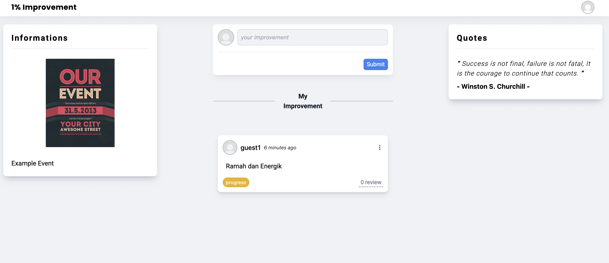
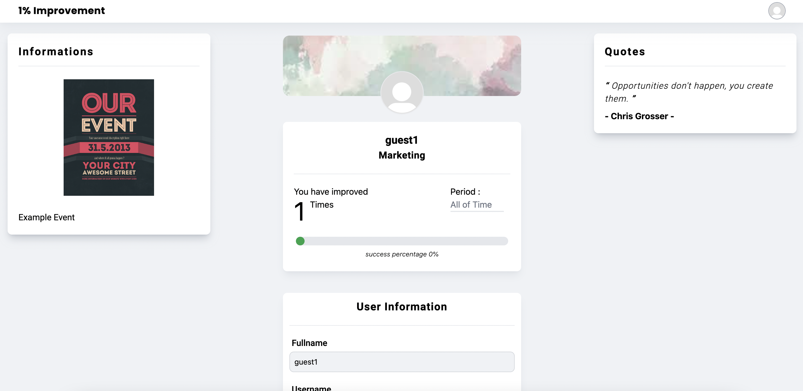

# One Percent Improvement - Client Side (Employee)
Aplikasi One Percent Improvement (employee) merupakan aplikasi sederhana pengembangan diri untuk karyawan pada suatu perusahaan. Karyawan diwajibkan mengisi Improvement setiap harinya 1 kali dan karyawan dapat mereview improvement yang mereka buat pada hari itu (Pending dan Done). Hasil semua improvement karyawan yang dibuat akan dipresentasekan. 

Karyawan hanya bisa mereview dan mengedit improvement yang dibuat hanya satu kali. Selain itu karyawan akan bisa melihat motivasi secara random, Broadcast flyer event terdekat pada suatu perusahaan. Edit data diri, infinite scrolling dan responsive.

Aplikasi One Percent Improvement menggunakan ReactJS, Tailwind CSS, Redux pada bagian Frontend.




#### Account :
```sh
username: guest1
password: 123456
```

### Follow this step :
- Buka Terminal pada lokasi folder project client side (frontend)
- Ketikkan `npm install`
- Buka file .env dan edit sesuaikan dengan endpoint server
- Setelah itu ketikkan `npm run start`
